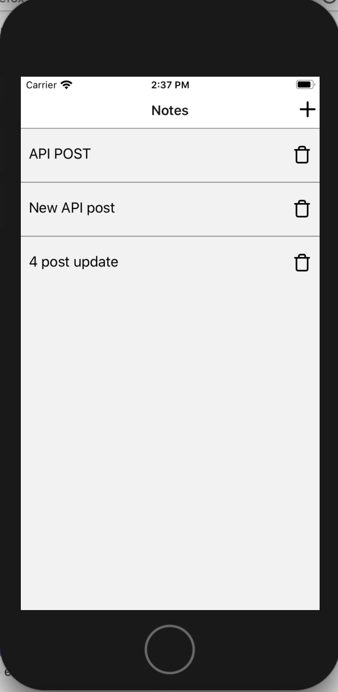
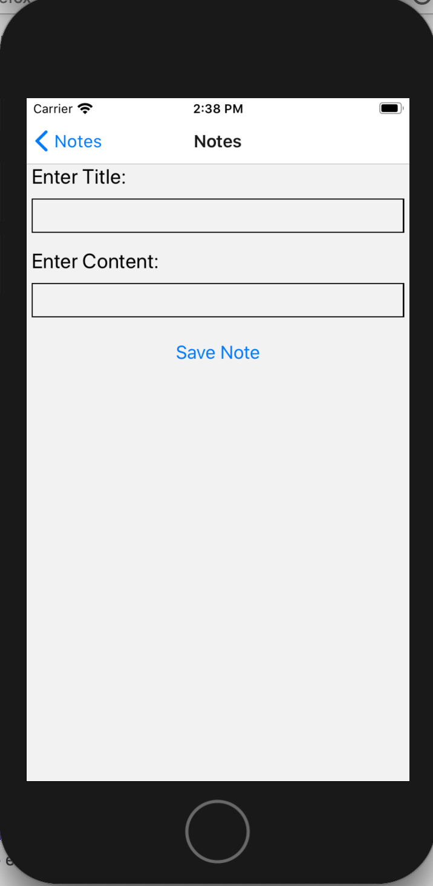
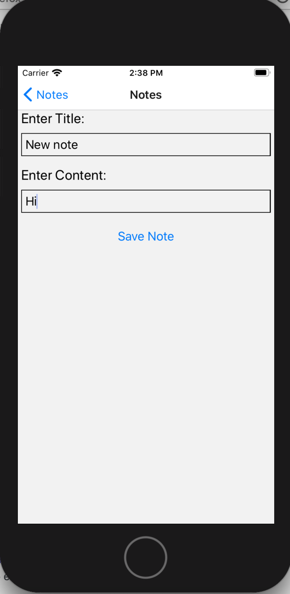
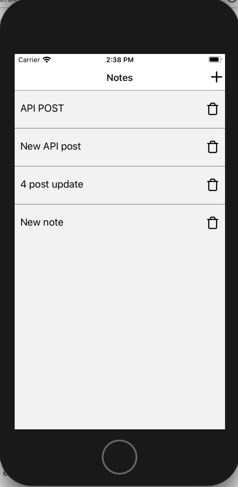
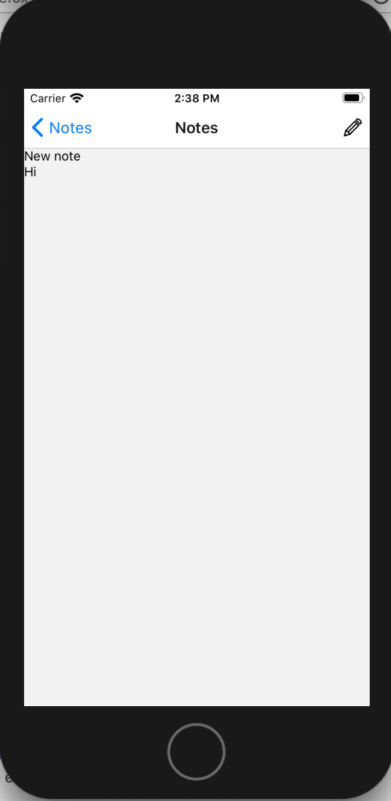
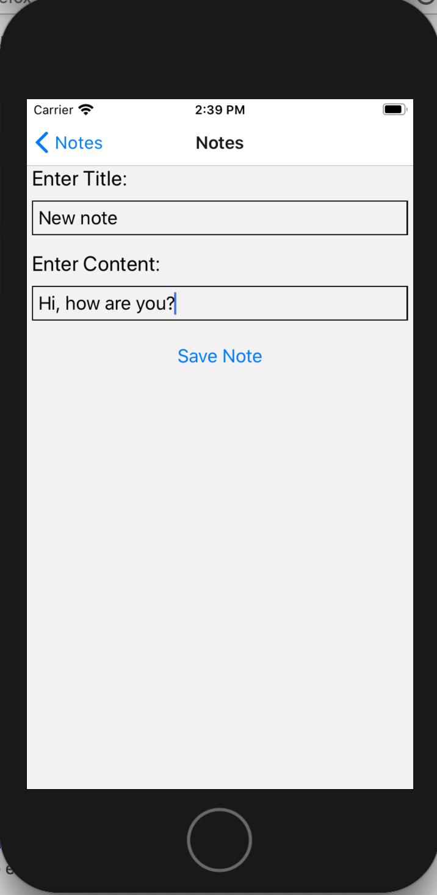
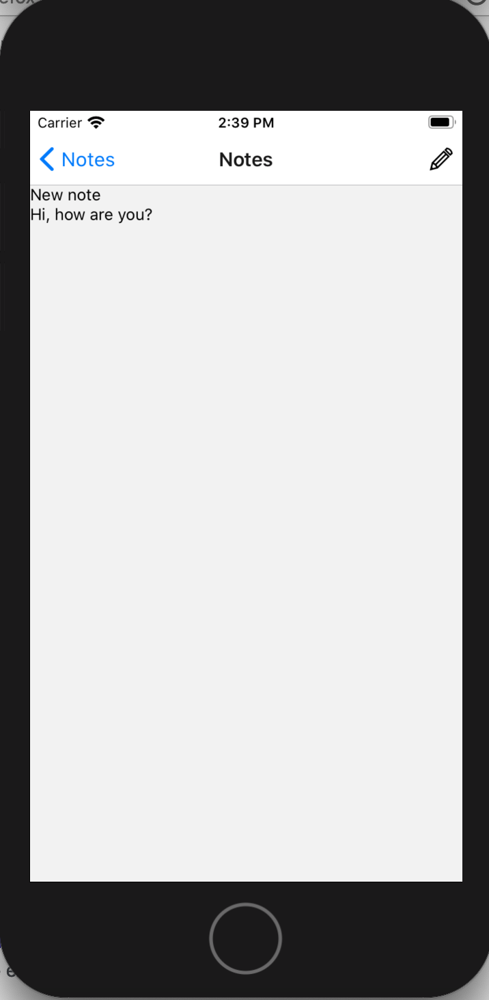

# Note taking app

Basic note taking app using CRUD and an API call to a Json server. At the moment this doesn't have a proper backend and I have been using Json server to handle this as I developed the app.

## instructions

run ` npm install` to install all the packages needed
run `nom start` or `expo start` to start the app

**_See Additional services on setting up the backend for development_**

##Screenshots

### Home Screen

Here is a view of the home screen

### Add a note

Click on the + symbol to adda new note
| |   |

### View note

when you tap on a notes title you see the notes full details including its contents

### Editing a note

To edit a note you click on the pensil icon in the view note screen. This will pre-populate the title and content for you. From here you can change what you want and then save the note. Once saved you go back to the detail view showing the changes.

 

## Additional services

Using json-server and Ngrok as a development backend

Update API URL in src/api/jsonServer.js after running Ngrok to get the correct base URL
